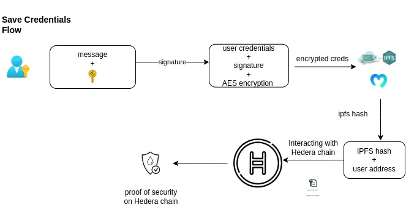
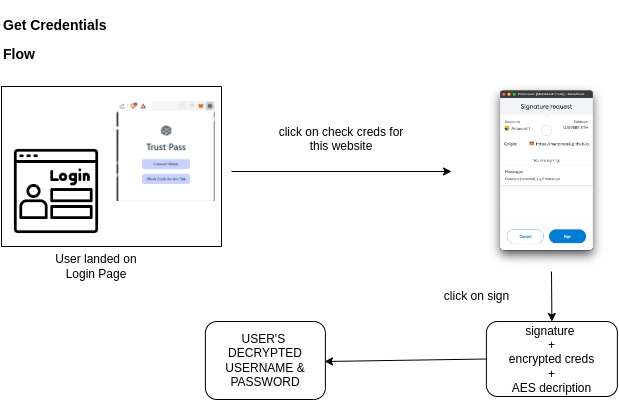

# trustless-pass

A never-before-seen Web2 credentials management application. Store and access your credentials in a purely non-custodial and trustless way.

## Demo App

## Description

Trustless-Pass is a web app and browser extension designed to store and access users' Web2 credentials in a trustless manner. When users secure their credentials, Trustless-Pass prompts them to provide their signature to encrypt and store the information. We issue a proof of security on the Hedera blockchain, allowing users to verify and ensure the safety of their data. No one other than the user can view or access the credentials, as everything is encrypted using the user's MetaMask wallet signature.

For example, when a user wants to log in to Amazon.com, our browser extension will prompt them to provide their signature to access and decrypt their Amazon.com credentials.

## Save Creds Flow

## Get Creds Flow

## Deployed Contract for Trsutless-Pass dapp on Hedera Blockchain

### TrsutlessProof

- https://hashscan.io/testnet/contract/0.0.4807203