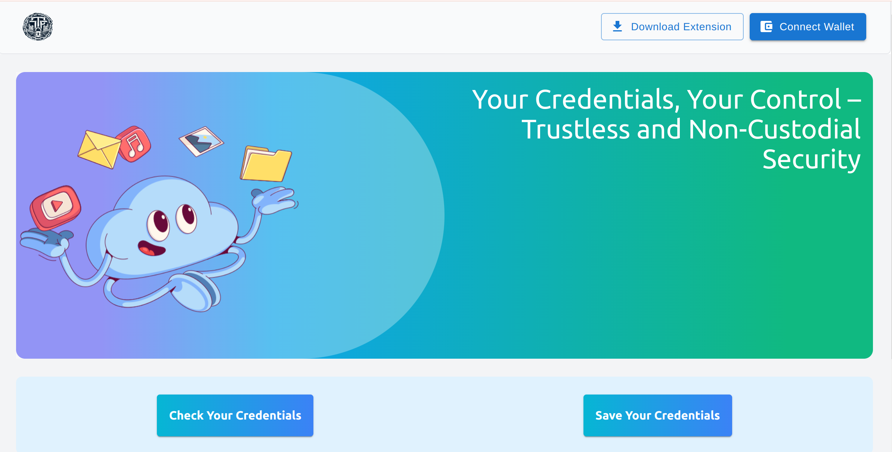
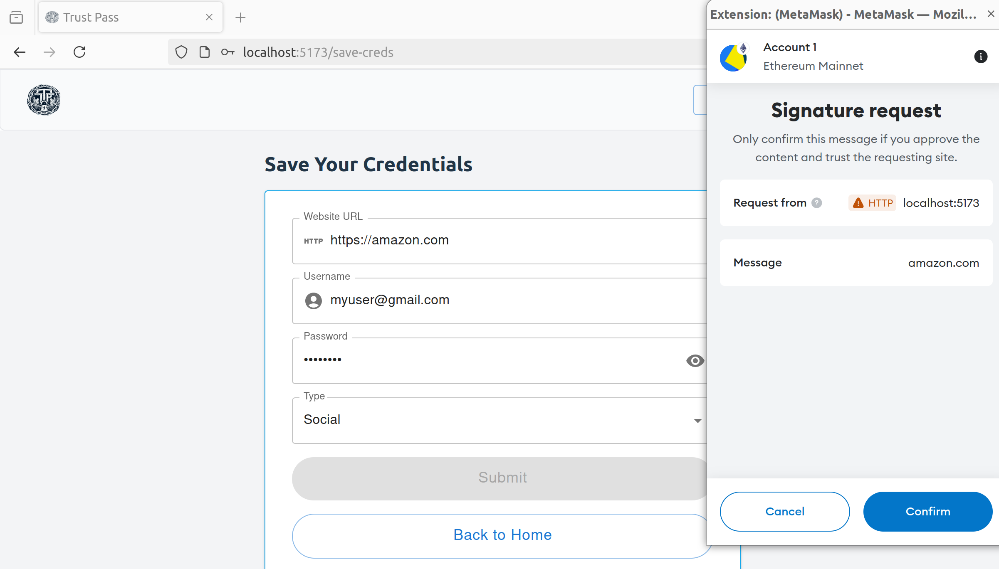
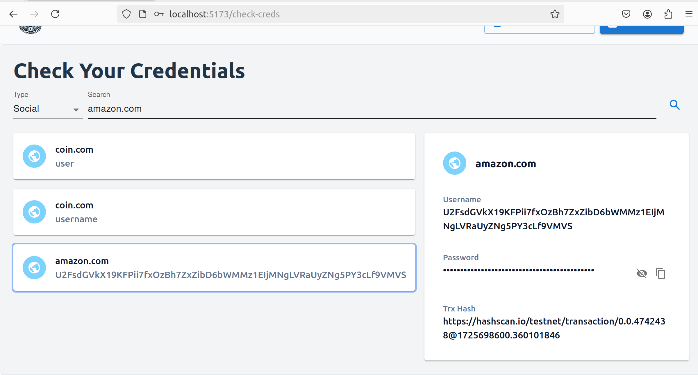

# trustless-pass

A never seen before Web2 credentails management application. Store and access your credentails purely in non-custodial and trsutless way. 

## Demo App

## Description

trustless-pass is a web app and browser extension designed to store and access users' Web2 credentials trustlessly. When users secure their credentials, trustless-pass prompts them to provide their signature to encrypt and store the credentials. We issue a proof of security on the Hedera blockchain so users can verify and ensure the safety of their data. No one other than the user can see or access the credentials, as everything is encrypted using the user's MetaMask wallet signature.

For example, if a user wants to log in to Amazon.com, our browser extension will prompt them to provide their signature to access and decrypt the credentials for Amazon.com.

## Deployed Contract for trsutless-pass apps on Hedera Blockhain

### TrsutlessProof

- https://hashscan.io/testnet/contract/0.0.4807203